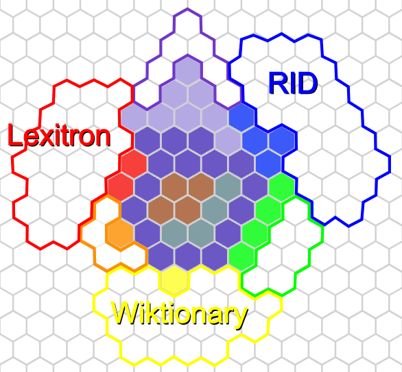

# Map of the frequency list 

This strategy game style of hexagon map highlight the space occupied by the frequency list in the overall dictionary space.

<!-- more -->

{ align=left }
/// caption
**Hexagon map of thelist vs 3 authoritative dictionaries**
///

Reading key:

- Each hex represent ~ 500 words.
- Colours:
    - in BLUE, the Royal Institure dictionary;
    - in RED, the NECTEC Lexitron 2.0 (th-en);
    - in YELLOW, the Thai Wiktionary, as of Sept. 2025;
    - blue AND red is purple, etc.
- Filled vs non-filled hexs:
    - The filled hex represent the coverage of the frequency list;
    - Un-filled hexes represent words in a given dict —or combo—, which are not in the list.
- Special:
    - DARK PURPLE at the center is for 8k words present in the list **and** all 3 dicts;
    - GREY BLUE at the center is for 2k words, present in all 3 dict, but **not** in the list.

## Stats & interpretation

The map show the strategic position of the list in the space of Thai words.

The superset —union— contains roughly 65k words. Give or take a few thousands, this is also the size of the vocabulary used in the Thai Wikipedia —not the wiktionary, the full encyclopedia—, and the size of the ailing thai-language.com dictionary.

The list covers 8k words present in 3 dicts, another 6kw present in 2, and a final 3kw present in 1 dict. The 2kw grey blue words present in all 3 dicts, but not in the list, are likely very useful words for Thai L2 leaners, but not for Thai school children.

See also [Wikipedia words and frequencies](wikipedia_analysis.md)

## Sources

Three autoritative dictionaries have been chosen:

- The Royal Institute Dictionary (RID), ed. 1999. Authoritative, prescriptive Thai-Thai dictionary.
- Lexitron 2.0, undated (prob. ~2011). Academic, government funded Thai-English dictionary.
- Thai Wiktionary Sept. 2025. Collaborative Thai-Thai and Thai-languages dictionary, tightly controlled.
