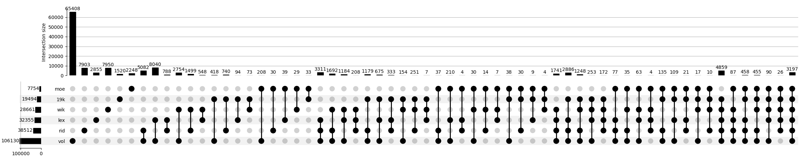

# Analysis of Thai dictionaries

In this post, we are looking at the size of various dictionaries and considering overlaps and differences.

<!-- more -->

## Size of entries

| sources | words | senses | notes |
| :--- | ---: | ---:| :--- |
| Frequency list | **19,494** | n/a | 1 |
| Lexitron | 33,060 | **40,854** | 2 |
| Volubilis | 102,358 | **113,682** | 3 |
| RID'99 | **38,603** | ? | 4 |
| wiktionary | **33,292** | 42,651 | 5 |
| MoE | ~8k | ~8k | 6 |
| th.wikipedia | ~70k |  | 7 |
| 4k Nielsen/U.Chula | ~4k | `4k | 8 |
| thai-language.com | 65-70k | ? | 9 |
| thwordnet | tbd | ? | 10 |

**Notes**

For each dictionary/list, the bold figure represents its main organisation.

1. 2016, additional info: frequency rank in corpus, measures of complexity. See [Frequency List](../../reference.md)
2. c.2011, Lexitron 2.0, Thai to English set.
3. July 2025, Volubilis 25.2. Thai-lang, contains abbrev., proper nouns, variants, etc.
4. 1999, Royal Institute Dictionary, (version 2011 not available as a digital set, it has 41k+ entries). Th-th reference. TODO parsing to extract word-senses
5. Sept. 2025, Thai wikitionary entries, word-senses in Thai and/or English. Strict open source collaborative process.
6. 2024?, Ministry of Education, prescriptive list of vocabulary for pre-school and primary students.
7. Sept.2025, vocabulary list and frequency extracted from Thai wikipedia. See [wikipedia analysis](wikipedia_analysis.md)
8. unknown date, Nielsen/University of Chula frequency list of 4,000 words. Th-En.
9. 1999?-2025 oct., thai-language.com th-en online dictionary. Temporarily (?) defunct at the time of writing. Created by Glenn Slayden, and enriched collaboratively (restricted, but not formal). TLC has also rich data for non-opaque compound as well (not counted in entries)
10. last update 2011, Thai WordNet, a graph of relationships between sets of words with related meaning. Not studied yet.

### Interpretation

The Ministry of Education prescriptive list contains 2,248 unique words —not found in others list nor dicts! See next section for details. NOT YET explained.

The 4k Nielsen/Chula frequency list has 53% common words with the 20k frequency list. This comparison was done early in the overall analysis and may not include all data cleaning used at later stages. TODO redo the analysis.

A special mention: the paiboon+ reference

The Paiboon+ dictionary —not the stand-alone phrasebook, should be the goto tool of any Thai L2 learner who can afford the iOS or Android app. [Entry counts](https://word-in-the-hand.com/thai-phrasebook-dictionary-app-entry-counts/) explains why entry counts are only a rough-and-ready way to compare dictionaries. It also, in a humblebrag-kind of way, shows why it is vastly superior to alternatives. (We do not have a relationship with Paiboon Publishing, except as a customer).

Paiboon+ Th-En non-place entries: 63,316. More or less all nouns have classifiers. They are categorized in cats and subcats.
Entries have Thai and English sounds, words can be decompose into smaller units, the spelling is explained.
The associated phrasebook is also incredibly rich. Paiboon+ has many more features and entries (including English to Thai), but this number of 63,316 entries is what is comparable to the dictionaries under review.

!!! info

    Counting entries is just enough to define the universe. Which is why in the rest of this analysis, we will compare word for word.

## Spread across all the sources

/// caption
**Upset plot showing all subgroup sets obtained by comparing all lists and dictionaries**
///

| source | total              | unique           | ratio | notes |
| :------ | ------------------: | ----------------: | -----: | :-----: |
| moe    |              7,754 |            2,248 | 29%   | 1     |
| 20k    |            19,494  |            1,520 | 8%    | 2     |
| wikt   |            28,661  |            7,950 | 28%   | 3     |
| lex    |            32,355  |            2,855 | 9%    | 4     |
| rid    |            38,512  |            7,903 | 21%   | 5     |
| vol    |          106,130   |          65,408  | 62%   | 6     |

notes:

2- 8% for v1; in v2.4 we brought it down to 1.5%.
3 & 5- Very high ratio of unique words, likely due to two reasons: a- a slightly different purpose, and b- non-standard entries.

The uniqueness ratio is still quite high for two authoritative dictionaries, and as we will see below, it gets worse.

Due to memory limitations, this analysis couldn't proceed further. The number of subgroups in the plot also means that visual insight is low. Finally, the large number of subgroup sets of of word had no practical use.

Did we learn something?

Yes, that Thai dictionaries are highly idiosyncratic, i.e. very contextual (not a surprise to any mid- to advanced-L2 learner), and that makes them more sensitive to domain and purpose. Feel free to comment below if you have alternate/complemtary hypothesis.

Any good news?

Yes, the plot is quite dense on the right. It means that the 20k list has a strong congruence with the authoritative dictionaries, within many words in3, or at least 1-2 of the dictionaries. A good hint that the words are relevant to daily use in many contexts, not just school textbooks.

## A more manageable subset

As a next step, we eliminated small lists, and the oversized Volubilis.

/// caption
**Upset plot showing all subgroup sets obtained by comparing a 4 lists and dictionaries**
///

Two main lessons immediately jump to the fore:

1. The uniqueness ratios are way down, using core lists and dicts, and of similar sizes.
2. This lead to the development of another graphical representation [See hexmap in sep. page](./map_list_dicts.md) which highlight commonality more than difference.

## Pair-wise set similarities

We nevertheless proceeded to further analysis on each pair, comparing them with an overlap ratio.

/// caption
**Pair-wise set similarities (reduced set)**
///

As this coefficient is less sensitive to inequal group size, we decided to run the full gamut. Note that the size ranges from 8k to 100k+, so it still impacts the results.

/// caption
**Pair-wise set similarities (full set)**
///

## A mystery? English vs Thai dict sizes

The superset of the core 4, as well as TLC, and words extracted from wikipedia, all have around 65-70k words.

By comparison, standard English dictionaries[citation needed 555](https://en.wikipedia.org/wiki/List_of_dictionaries_by_number_of_words), may have 400k, and upwards of 1M words. How is that?

### Confirmed Primary Factors: Lexicographical Tradition & Scope

The massive difference in dictionary size (~40k vs. ~400k+ entries) is strongly supported as being due to the **historical and exhaustive scope of English lexicography** (like the OED), which contrasts with the focus and maturity of the official Thai dictionaries.

* **Exhaustive/Historical Scope:** Major English dictionaries aim to be exhaustive, including a vast number of **obsolete words** (e.g., the *Oxford Dictionary of English* has 47,156 obsolete words out of 273,000 headwords) and covering **historic and multiple Englishes** (British, American, etc.).
* **Word-Forms and Derivatives:** The highest counts for English (up to 600,000 "word-forms") are achieved by including all **combinations, phrases, and derivatives**, in addition to headwords. Some English dictionaries explicitly include **irregular inflected forms** (like *ate* and *eaten*) as separate entries or cross-references, though this is numerically a minor factor.
* **Inclusion of Specialized Terms:** The high-end estimates for English (up to a million words) explicitly include **Latin species names, scientific terminology, and jargon**, confirming the initial hypothesis that these domains inflate the English count significantly.
* **Number of Speakers**: The massive number of English speakers (over 1.2 billion globally), now and cumulatively in history, contributes to a constant influx of new words, variants, and specialized terminology.

### Secondary Factors: Linguistic Structure & History

The factors below reinforce the linguistic and historical context that makes Thai vocabulary inherently more compact in a standard dictionary format.

* **Analytical vs. Inflected Structure:** Thai is an **analytical language** with no verb conjugation (e.g., no *eat/ate/eaten* forms) and no plural forms for nouns, which means its dictionary needs only one entry (a single *lemma*) where an inflected language like English or German might still list multiple forms or derivatives. For instance, the **English morphological system** —though simpler than German— still creates more distinct forms than Thai.
* **Absence of Colonial Expansion/Borrowing:** While English vocabulary has been exponentially expanded by a **colonial history, large empire, and acceptance of loanwords**, Thai has a different historical trajectory. The development of modern **Thai lexicography** (starting with the first monolingual dictionary in 1873) was more linked to internal socio-political developments and foreign missionary influence, resulting in a more focused, often **prescriptive** approach by the Royal Institute, which traditionally resists massive foreign borrowings.
* **Lexicographical Inconsistency (Internal Thai Factor):** The initial observation that the **major Thai dictionaries only share 25–30% of their words** may point to a **lack of standardized corpus-based lexicography** or a more fundamental difference in what various Thai authorities deem "authoritative," contributing to the lower total count and fragmented consensus.

!!! info "Toward a v.3 of the list?"

    The superset of the core 4, as well as TLC, and words extracted from wikipedia, all have around 65-70k words. Because wikipedia was a 125M words corpus, it become feasible to envision building a ranked list of that size, with all the dimensions of the 20k list, possibly more (domain, register, etc.). Not a job for tomorrow, but something to consider