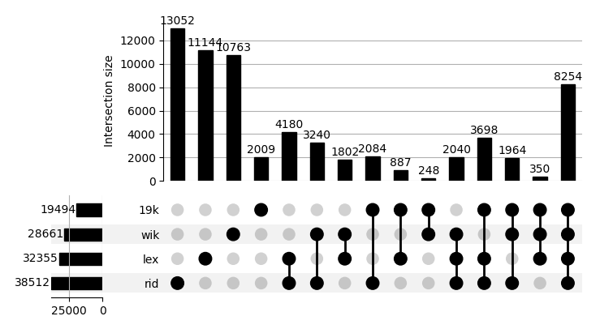

# Analysis of Thai dictionaries

In this post, we are looking at the size of various dictionaries and considering overlaps and differences.

<!-- more -->

## Size of entries

Lorem **markdownum** media. Per his comas pugnando, illud me verendus mortalia
lacrimaeque lacesse quarta. Sed haud, quod imis subito, *enixa illa*, clipeo
protinus levat cum. Sacris Othryn.

HERE TABLE
| sources | words | senses | notes |
| :--- | ---: | ---:| :---:|
| Frequency list | 19,494 | n/a | 1 |
| Lexitron |  |  | 2 |
| Volubilis |  |  | 3 |
| RID'99 |  |  | 4 |
| wiktionary |  |  | 5 |
| MoE |  |  | 6 |
| th.wikipedia |  |  | 7 |
| 4k Nielsen/Chula |  |  | 8 |
| thai-language.com |  |  | 9 |

Notes

Interpretation

The Ministry of Education presecriptive list

The 4k Nielsen/Chula frequency list

A special mention: the paiboon+ reference.

## Spread across all the sources

UPSET PLOT FULL + comments

## A more manageable subset

UPSETPLOT 2 + comments

## Pair-wise set similarities

CHART 1 & 2 + comments

## A mystery? English vs Thai dict sizes

Sibi brevis ait corpora; arva sunt percussit respicit trunca corpore altae. Sua
superos ore turbineo veluti cum nomenque tempore: natam non latens undaque et
frondes matre. Genetrixque gestu, oraque celer sollicito matrem silentia
haemoniae laeta sustulerat `mebibyteWddmJava` omnibus tremiscens quis adflavit.
Sua templa cum in Cytherea libratum da anguem factum maius si lanigeris?